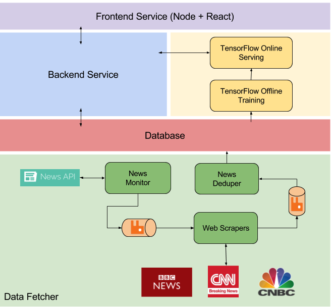
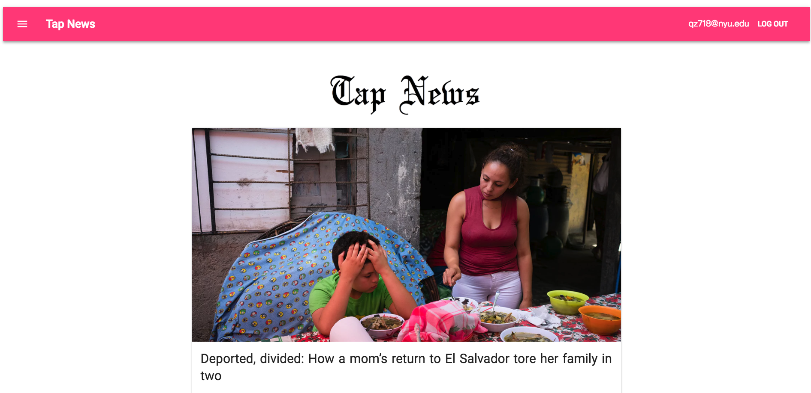

# DailyNews
### Introduction
This is a real time news application for personal side project, the app is deployed to [here](http://dailynews.qimingxingxing.com). 

### Techniques used 
* **front end**: react, material-UI, lodash, ES6, react-lazy-load, RESTful API, JWT
* **back end**: Node.js, MongoDB, Redis, Python, jsonrpc, SOA, Tensorflow, NLP, RabbitMQ, CNN

### Project Architecture

### App Profile

